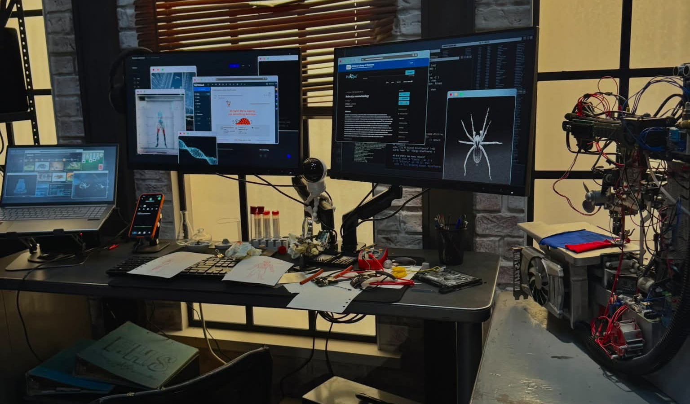

<div align="center">



### `home-ops` — with great power comes mild responsibility 🕷️

_... managed with [Flux](https://fluxcd.io/), [Renovate](https://docs.renovatebot.com/), and [GitHub Actions](https://github.com/features/actions)_ 🤖

<sub>Header photo: Peter Parker's apartment from the *Spider-Man: Brand New Day* pop-up tour</sub>

</div>

<div align="center">

[](https://www.talos.dev/)
[](https://kubernetes.io/)
[](https://fluxcd.io/)
[](https://github.com/alexmathieu22-ops/home-ops/actions/workflows/renovate.yaml)

</div>

<div align="center">

[](docs/adr/observability/2026-08-22-minimal-prometheus-for-kromgo.md)
[](docs/adr/observability/2026-08-22-minimal-prometheus-for-kromgo.md)
[](#hardware)
[](docs/adr/observability/2026-08-22-minimal-prometheus-for-kromgo.md)
[](docs/adr/observability/2026-08-22-minimal-prometheus-for-kromgo.md)
[](docs/adr/observability/2026-08-22-minimal-prometheus-for-kromgo.md)

</div>

## Overview

`home-ops` is my personal homelab, run entirely as code: [Talos Linux](https://www.talos.dev/)
+ Kubernetes, GitOps via [Flux CD](https://fluxcd.io/), secrets via 1Password + External
Secrets Operator, public exposure via Cloudflare Tunnel, and VPN via a self-hosted
Headscale. Every change ships through `git push` — see [Stack](#stack) below, [Repo
layout](#repo-layout), and the [ADRs](docs/adr/README.md) for the how and why.

This wouldn't exist without [onedr0p/home-ops](https://github.com/onedr0p/home-ops),
[buroa/home-ops](https://github.com/buroa/home-ops), and the wider
[home-operations](https://github.com/home-operations) community — their repos are the
reference implementations I keep coming back to (and the first thing I point an AI
assistant at) whenever I'm bootstrapping a new piece of this cluster. Most of the
conventions here — the `kubernetes/apps` layout grouped by namespace, the Renovate setup,
the Flux bootstrap structure — started as "how did they solve this" visits to their repos.

## Stack

| Layer            | Choice                                                    |
| ---------------- | ---------------------------------------------------------- |
| OS / Kubernetes  | [Talos Linux](https://www.talos.dev/)                      |
| GitOps           | [Flux CD](https://fluxcd.io/)                               |
| CNI              | [Cilium](https://cilium.io/) (LB-IPAM + L2 announcements, no MetalLB) |
| Public exposure  | [Cloudflare Tunnel](https://developers.cloudflare.com/cloudflare-one/connections/connect-networks/) (cloudflared) |
| VPN              | Self-hosted [Headscale](https://headscale.net/) + Tailscale subnet router |
| Secrets          | [1Password Service Account](https://developer.1password.com/docs/service-accounts/) via [External Secrets Operator](https://external-secrets.io/) (`1password-sdk` provider) — zero SOPS |
| Storage          | [Rook-Ceph](https://rook.io/) (planned; 0 usable OSDs on current hardware) + [local-path-provisioner](https://github.com/rancher/local-path-provisioner) (interim, node-local, cluster default `StorageClass` for now) |
| Ingress          | [Envoy Gateway](https://gateway.envoyproxy.io/) (Gateway API) — `internal` Gateway (VPN/tailnet only) + `external` Gateway (public, behind cloudflared) |
| Observability    | [Gatus](https://github.com/TwiN/gatus) (status page) + metrics-server (`kubectl top`/k9s) + a minimal [kube-prometheus-stack](https://github.com/prometheus-community/helm-charts) (Prometheus/kube-state-metrics/node-exporter only) feeding [kromgo](https://github.com/home-operations/kromgo) for the README badges above |
| LAN DNS          | TBD — [AdGuard Home](https://adguard.com/adguard-home/) removed for now; deciding between redeploying it or moving to a [Ubiquiti](https://ui.com/) UDM (the ISP router can't do local DNS records) |
| Dependency mgmt  | [Renovate](https://docs.renovatebot.com/)                   |
| Tool versions    | [asdf](https://asdf-vm.com/)                                 |
| VPN host provisioning | [OpenTofu](https://opentofu.org/) (Oracle Cloud VM + DNS only, see below) |

See [PROJECT_BRIEF.md](docs/planning/PROJECT_BRIEF.md), [E2E_PLAN.md](docs/planning/E2E_PLAN.md),
[HARDWARE_PLAN.md](docs/planning/HARDWARE_PLAN.md), and the [ADRs](docs/adr/README.md)
for the full rationale, rollout plan, and per-component implementation gotchas (resource
YAML itself keeps only short pointers, not full rationale).

## Repo layout

```
home-ops/
├── .tool-versions              # asdf-managed CLI versions
├── talos/                      # talhelper config + generated machine configs (gitignored,
│                                 # except talsecret.sops.yaml -- SOPS/age-encrypted, see
│                                 # .sops.yaml -- committed on purpose)
├── terraform/
│   └── headscale/               # OpenTofu: Oracle Cloud VM + DNS for Headscale -- the one
│                                 # place in the repo Terraform is used (real cloud
│                                 # resources with real lifecycle; see secret-zero.md for
│                                 # why it's not used for secrets)
├── bootstrap/
│   ├── kustomize/               # secret-zero: op inject + kubectl apply, no Terraform
│   └── helmfile/                # installs Cilium before Flux exists (chicken-and-egg:
│                                 # nothing gets pod networking without it, Flux included)
├── kubernetes/
│   ├── flux/cluster/           # Flux's own bootstrap manifests + the one top-level sync
│   └── apps/                   # one tree grouped by K8s namespace (onedr0p/buroa convention):
│                                # kube-system (cilium, metrics-server, local-path-provisioner),
│                                # cert-manager, external-secrets,
│                                # rook-ceph, networking (envoy-gateway, cloudflared,
│                                # headscale-subnet-router, gateway-api-crds), observability
│                                # (gatus), default (home apps)
│                                # -- each component as <name>/{ks.yaml, app/, config/}
├── .github/workflows/          # Renovate, CI (kubeconform validation)
└── docs/runbooks/              # the handful of manual, non-GitOps steps
```

## Hardware

Running single-node for now on a **HP ProDesk 600 G4 Mini** (i5-8500T, 8GB RAM, 256GB
SSD). `talos/talconfig.yaml`'s `nodes:` block has just this one real node; see
[`docs/runbooks/cluster-bootstrap.md`](docs/runbooks/cluster-bootstrap.md) for the
bare-metal install steps and known single-node limitations (no etcd HA, no spare disk
for Rook-Ceph OSDs yet, 8GB RAM is tight). More nodes get appended to the same file when
they arrive — nothing else in the repo changes.

## Local dev cluster

Disposable Talos + Kubernetes cluster for testing a Renovate chart bump or a new app
locally before it touches real hardware — see
[`docs/runbooks/cluster-bootstrap.md`](docs/runbooks/cluster-bootstrap.md#why-docker-not-qemu)
for the why-Docker-not-QEMU details:

```bash
talosctl cluster create docker --name home-ops-dev --workers 0 --memory-controlplanes 6GB \
  --config-patch '{"cluster":{"network":{"cni":{"name":"none"}},"proxy":{"disabled":true}}}'
```

## Manual steps (everything else is `git push`)

1. [`docs/runbooks/cluster-bootstrap.md`](docs/runbooks/cluster-bootstrap.md) — bring up
   the node(s) (first apply to a node in maintenance mode needs
   `talhelper gencommand apply --extra-flags "--insecure"`, or you'll hit
   `x509: certificate signed by unknown authority` — see the runbook), then
   `helmfile -f bootstrap/helmfile/helmfile.yaml sync` to install Cilium *before* Flux
   (nothing, including Flux's own controllers, gets pod networking without it — Talos's
   CNI is disabled), then `flux bootstrap github`
2. [`docs/runbooks/secret-zero.md`](docs/runbooks/secret-zero.md) — `op inject | kubectl apply`
   from an authenticated local `op` session
3. [`docs/runbooks/cloudflare-setup.md`](docs/runbooks/cloudflare-setup.md) — API token +
   Tunnel token into 1Password (not required for Headscale/VPN, only for public exposure
   and the internal Gateway's TLS cert)
4. [`docs/runbooks/headscale-oracle-cloud.md`](docs/runbooks/headscale-oracle-cloud.md) —
   `tofu apply` the Oracle Cloud Always Free VM (outside the cluster by design, provisioned
   via [`terraform/headscale/`](terraform/headscale)), then wire the in-cluster subnet
   router to it
5. LAN DNS — TBD (AdGuard Home removed, deciding between redeploying it or a Ubiquiti UDM).
   Whichever it ends up being, set it as the **primary** DHCP DNS server on the router
   (ISP-provided), keeping a public resolver (e.g. `1.1.1.1`) as secondary so general
   internet DNS still works if it's ever down.
